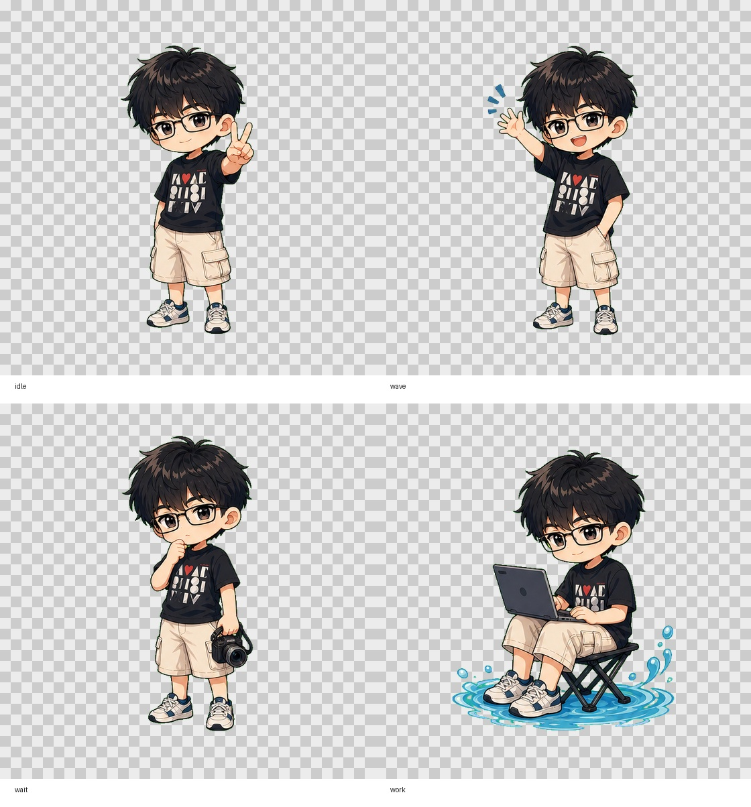

# Codex Pet Ruo

由用户照片生成的 Q 版动漫风格 Codex 自定义宠物。

仓库包含：

- Q 版动漫四状态素材
- Codex 自定义宠物预构建包
- 一键安装脚本
- 可重复生成 `spritesheet.webp` 的构建脚本

> 说明：原始照片未提交到仓库。仓库中只包含生成后的动漫素材和 Codex pet 包。

## 快速安装到 Codex

### 环境要求

- 已安装 Codex
- 已安装 Git
- 能访问 GitHub

### macOS / Linux

```bash
git clone https://github.com/wangyaruo/codex-pet-ruo.git
cd codex-pet-ruo
bash scripts/install-codex-pet.sh
```

### Windows PowerShell

```powershell
git clone https://github.com/wangyaruo/codex-pet-ruo.git
cd codex-pet-ruo
powershell -ExecutionPolicy Bypass -File .\scripts\install-codex-pet.ps1
```

如果已经在 PowerShell 中，也可以执行：

```powershell
.\scripts\install-codex-pet.ps1
```

如果遇到执行策略限制，先在当前 PowerShell 会话中执行：

```powershell
Set-ExecutionPolicy -Scope Process -ExecutionPolicy Bypass
.\scripts\install-codex-pet.ps1
```

然后重启 Codex。自定义宠物名称是：

```text
Ruo Chibi Pet
```

macOS / Linux 默认安装到：

```text
${CODEX_HOME:-$HOME/.codex}/pets/codex-pet-ruo/
├── pet.json
└── spritesheet.webp
```

Windows 默认安装到：

```text
%USERPROFILE%\.codex\pets\codex-pet-ruo\
├── pet.json
└── spritesheet.webp
```

如果设置了 `CODEX_HOME` 环境变量，安装脚本会优先使用 `CODEX_HOME`。

### 手动安装

macOS / Linux：

```bash
mkdir -p ~/.codex/pets/codex-pet-ruo
cp pet-package/codex-pet-ruo/pet.json ~/.codex/pets/codex-pet-ruo/pet.json
cp pet-package/codex-pet-ruo/spritesheet.webp ~/.codex/pets/codex-pet-ruo/spritesheet.webp
```

Windows PowerShell：

```powershell
New-Item -ItemType Directory -Force "$env:USERPROFILE\.codex\pets\codex-pet-ruo"
Copy-Item ".\pet-package\codex-pet-ruo\pet.json" "$env:USERPROFILE\.codex\pets\codex-pet-ruo\pet.json" -Force
Copy-Item ".\pet-package\codex-pet-ruo\spritesheet.webp" "$env:USERPROFILE\.codex\pets\codex-pet-ruo\spritesheet.webp" -Force
```

## 素材预览

四状态素材预览：



Codex 9 行动画图集预览可通过构建脚本生成：

```bash
/Users/wangyaruo/.cache/codex-runtimes/codex-primary-runtime/dependencies/python/bin/python3 tools/build_codex_pet.py
```

生成后查看：

```text
dist/codex-pet-ruo/contact-sheet.jpg
```

## 目录结构

```text
.
├── README.md
├── assets
│   ├── preview_sheet.png
│   ├── state-map.json
│   ├── state_preview_checker.jpg
│   ├── states
│   │   ├── idle.png
│   │   ├── wave.png
│   │   ├── wait.png
│   │   └── work.png
│   └── states-trimmed
│       ├── idle.png
│       ├── wave.png
│       ├── wait.png
│       └── work.png
├── pet-package
│   └── codex-pet-ruo
│       ├── pet.json
│       └── spritesheet.webp
├── scripts
│   ├── install-codex-pet.ps1
│   └── install-codex-pet.sh
└── tools
    ├── split_assets.py
    └── build_codex_pet.py
```

## 四状态素材

| 状态 | 文件 | 说明 |
| --- | --- | --- |
| `idle` | `assets/states/idle.png` | 比耶待机 |
| `wave` | `assets/states/wave.png` | 开心挥手 |
| `wait` | `assets/states/wait.png` | 拿相机思考/等待 |
| `work` | `assets/states/work.png` | 坐下使用电脑 |

这些图片均为：

- PNG
- 透明背景
- `512 x 512`

## Codex 状态映射

Codex 自定义宠物需要固定 `8 x 9` 图集，单格 `192 x 208`，整张 `1536 x 1872`。

当前映射如下：

| Codex 状态 | 使用素材 | 说明 |
| --- | --- | --- |
| `idle` | `idle.png` | 待机微动 |
| `running-right` | `idle.png` | 右移状态 |
| `running-left` | `idle.png` | 左移状态，水平镜像 |
| `waving` | `wave.png` | 打招呼状态 |
| `jumping` | `idle.png` | 跳跃状态 |
| `failed` | `wait.png` | 失败/停顿状态 |
| `waiting` | `wait.png` | 等待用户输入状态 |
| `running` | `work.png` | 工作/处理中状态 |
| `review` | `work.png` | 审查/思考状态 |

## 重新生成 Codex Pet 包

如果修改了 `assets/states/*.png`，可以重新生成：

```bash
cd codex-pet-ruo
/Users/wangyaruo/.cache/codex-runtimes/codex-primary-runtime/dependencies/python/bin/python3 tools/build_codex_pet.py
```

输出位置：

```text
dist/codex-pet-ruo/
├── pet.json
├── spritesheet.webp
├── spritesheet.png
└── contact-sheet.jpg
```

把生成结果同步到预构建包：

```bash
cp dist/codex-pet-ruo/pet.json pet-package/codex-pet-ruo/pet.json
cp dist/codex-pet-ruo/spritesheet.webp pet-package/codex-pet-ruo/spritesheet.webp
```

再执行安装：

```bash
bash scripts/install-codex-pet.sh
```

Windows PowerShell：

```powershell
powershell -ExecutionPolicy Bypass -File .\scripts\install-codex-pet.ps1
```

## 生成说明

图片生成使用了用户提供的照片作为视觉参考，保留了这些特征：

- 黑色微乱短发
- 矩形眼镜
- 黑色图案 T 恤
- 浅色工装短裤
- 休闲运动鞋
- 比耶、挥手、拿相机、坐下工作等动作

为了保护隐私，原始照片不在仓库内。
